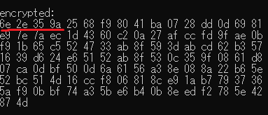
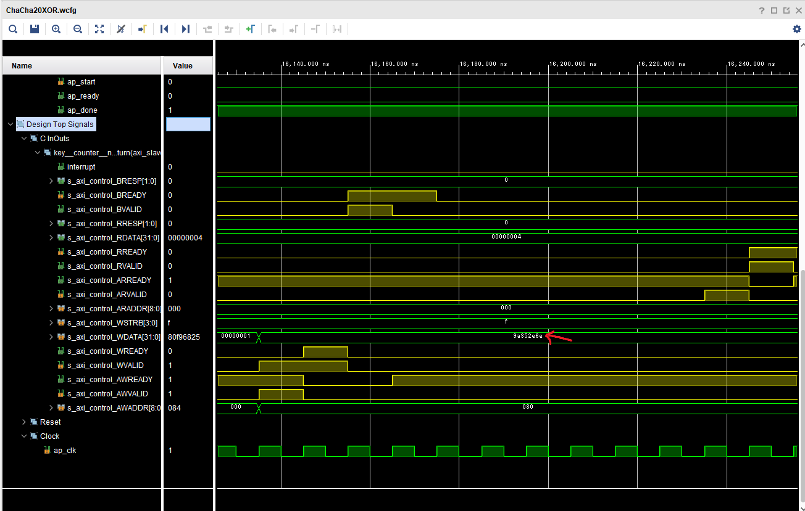
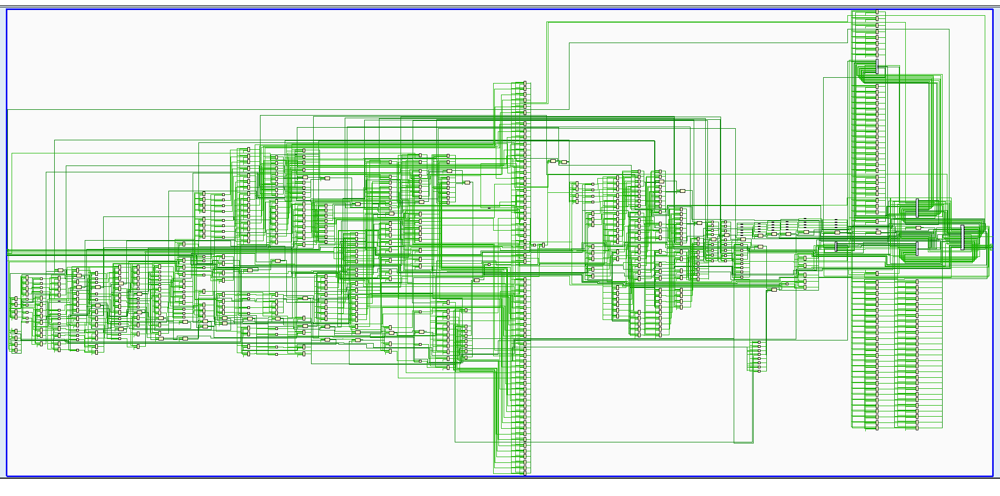
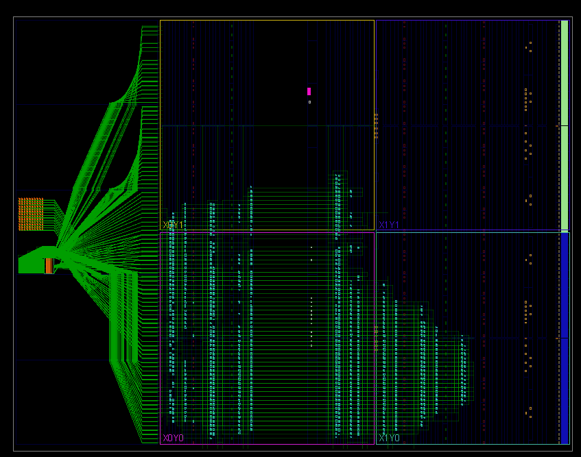

# ChaCha20 for HLS

ストリーム暗号ChaCha20を高位合成でFPGA実装した．

`test`ディレクトリにはソフトウェアとしてのC言語での実装が格納されており，ビルドすることで暗号化復号ができる．

`HLS`ディレクトリには高位合成のためのディレクティブが付与されたC++コードが格納されており，Vitis HLS 2022.01で合成を確認．

C言語での実装で出力された暗号文とVivadoのシミュレーションツール波形で出力された暗号文が一致している．

論理合成を行う．

配置配線．

